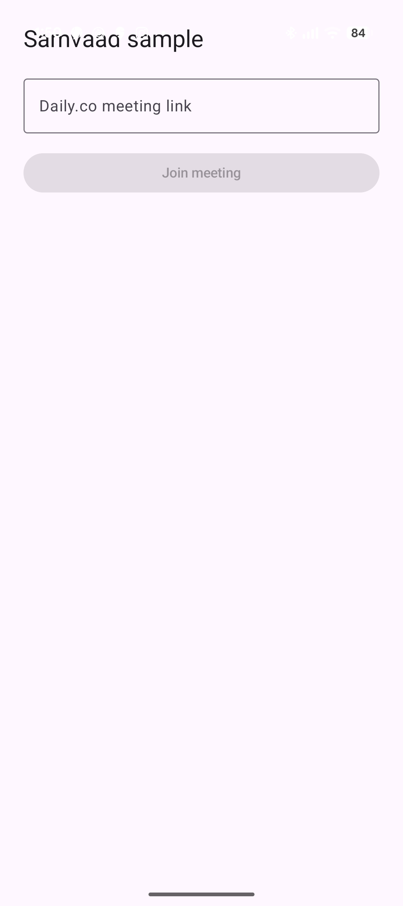
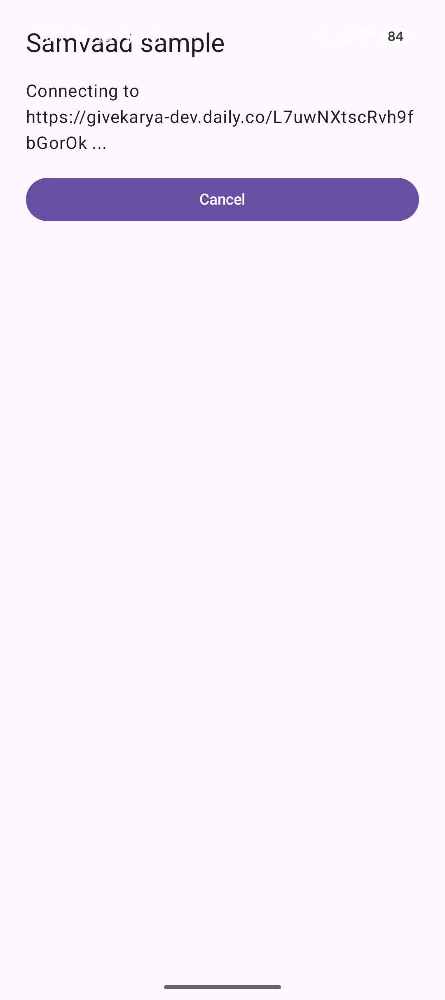
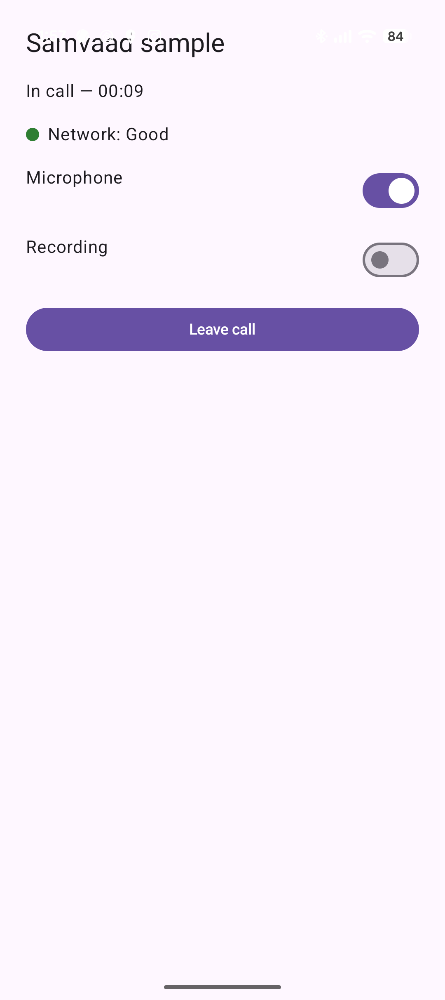

# Samvaad


[](https://github.com/karya-inc/Samvaad/blob/main/LICENSE)

Samvaad is a VoIP/conferencer calling library for Android, extracted and rearchitected from Karya's own app. It handles the mechanism every VoIP integration needs — provider-agnostic call lifecycle, a foreground-service/Binder layer, duration tracking, network quality reporting — and stays out of policy: UI, which provider you use, and your own backend all remain entirely up to you.

The library is split into:

- **`:samvaad-core`** – A pure-Kotlin interfaces module, framework-agnostic
- **`:samvaad-android`** – An Android implementation module built on top of the core interfaces
- **`:app`** – A runnable sample app demonstrating the full stack against Daily.co

## Features

- **Provider-agnostic calling** — implement one small interface (`VoipSdkClient`) per VoIP SDK (Daily.co, Twilio, Agora, ...); everything else in the library doesn't care which one you picked.
- **Foreground-service lifecycle, handled for you** — `AbstractVoipCallService` owns the `Service`/`Binder`/notification plumbing, self-stops on call end, and survives rotation/process death via reattachment.
- **Call duration tracking** — a single `durationSeconds` ticker, computed correctly even if the OS delays the coroutine, instead of every provider adapter risking its own subtly different bug.
- **Network quality reporting** — a graded `GOOD` / `POOR` / `BAD` reading per call, polled on the same ticker as duration and relayed reactively all the way to your UI, with a simple derived check for "is the network bad right now."
- **Composable, data-only UI state** — `ConferencerUiState` describes Idle/Incoming/Connecting/Ongoing/Disconnecting/Error; you decide what any of that looks like.
- **No base class to extend** — `ConferencerBinding` is a plain class you hold as a field and delegate to, so it never fights with your own `ViewModel`, DI-managed controller, or task-runtime base class.
- **Extendable, typed errors** — `SamvaadError` is open, not sealed: a `VoipSdkClient` implementation or your own backend can add its own failure types under the same hierarchy instead of being stuck with an untyped message string. Every error exposes a stable `errorCode` (survives a minified release build, unlike the class name) plus real fields (`provider`, `serviceClass`, ...) instead of only a human-readable sentence.
- **Tested against real lifecycle scenarios** — Robolectric-backed tests cover the bind/unbind and Service lifecycle edge cases that plain mocks can't reach (double-bind races, unbind-on-terminal-state, process death).

## Usage

### 1. Implement `VoipSdkClient` for your provider

The only piece that talks to a specific SDK. See `app/.../DailyCoVoipSdkClient.kt` for a complete reference implementation against Daily.co.

```kotlin
class MyProviderVoipSdkClient(context: Context) : VoipSdkClient {
    override val callState: StateFlow<VoipCallState> = /* ... */

    override fun join(config: String, role: CallRole) { /* ... */ }
    override fun leave() { /* ... */ }
    override fun toggleMic(enable: Boolean) { /* ... */ }
    override fun isMicrophoneEnabled(): Boolean = /* ... */
    override fun setRecordingEnabled(enabled: Boolean) { /* ... */ }
    override fun isRecordingEnabled(): Boolean = /* ... */
    override fun release() { /* ... */ }

    // Optional -- defaults to null ("no reading available"). A provider that doesn't
    // report this needs zero boilerplate to opt out.
    override fun networkQuality(): NetworkQuality? = /* ... */
}
```

### 2. Declare your foreground Service

```kotlin
class MyVoipCallService : AbstractVoipCallService() {
    override val sdkClientFactory: VoipSdkClientFactory = object : VoipSdkClientFactory {
        override fun create(provider: CallProvider): VoipSdkClient =
            MyProviderVoipSdkClient(applicationContext)
    }

    override fun buildNotification(): Notification =
        NotificationCompat.Builder(this, CHANNEL_ID)
            .setContentTitle("Call in progress")
            .setSmallIcon(R.drawable.ic_call)
            .build()
}
```

Declare it in your manifest with whichever `foregroundServiceType` fits your use case (`microphone`, `phoneCall`, ...) — the library deliberately stays silent on this, since it's your call, not the library's.

### 3. Drive it from your Activity/controller

```kotlin
val binding = ConferencerBinding(
    context = this,
    role = CallRole.CALLER,
    serviceClass = MyVoipCallService::class.java,
    callId = { meta -> meta.id },
    joinConfig = { meta -> meta.roomUrl },
    provider = { CallProvider.DAILYCO },
)
binding.attachIfRunning() // reattach to a call already running after rotation/process death

binding.acceptOrInitiate(MyCallMetadata(id = "...", roomUrl = "..."))
```

### 4. Render whatever `ConferencerUiState` gives you

```kotlin
when (val state = binding.uiState.collectAsState().value) {
    is ConferencerUiState.Ongoing -> {
        val duration by state.durationSeconds.collectAsState()
        val quality by state.networkQuality.collectAsState() // GOOD / POOR / BAD / null
        // render however you like -- the library has no opinion here
    }
    // Idle, Incoming, Connecting, Disconnecting, Error ...
}
```

The full, working version of all four steps lives in the `app` module — run it and point it at a real Daily.co room URL to see the whole stack in action.

## Sample app

<table>
  <tr>
    <th>Idle</th>
    <th>Connecting</th>
    <th>Ongoing — network quality</th>
  </tr>
  <tr>
    <td></td>
    <td></td>
    <td></td>
  </tr>
</table>

The third screenshot is the network-quality feature end-to-end on a real device: the green dot and "Good" label are a live reading from the call's actual network conditions, polled from the SDK layer and relayed up through `AbstractVoipCallService` → `ConferencerBinding` → the Compose UI shown above.

## Installation

Installation support is **pending and not yet published**. Samvaad will be published to a Maven repository in a future release. Check back for updates.
